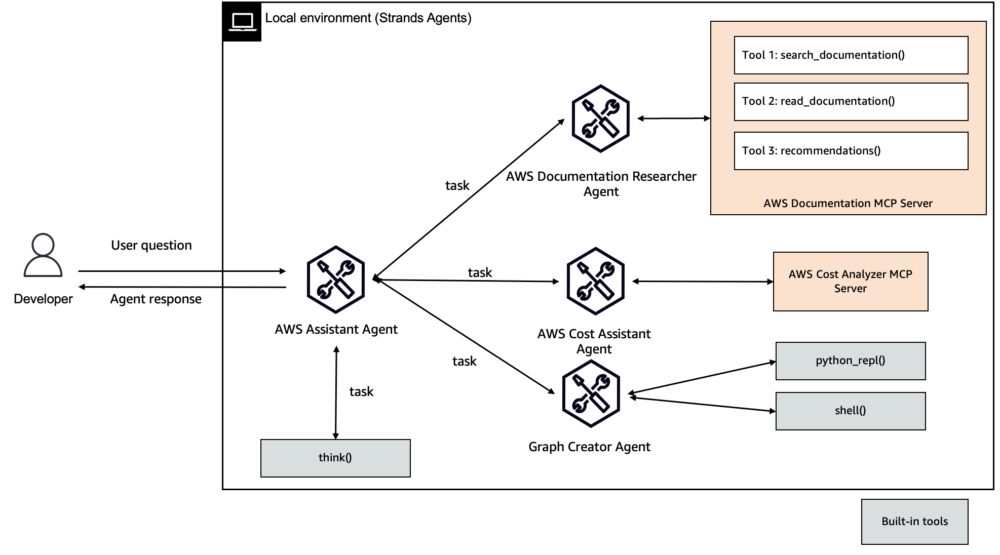

# 🚀 AWS Assistant

## Overview

AWS Assistant is a sophisticated multi-agent system designed to provide comprehensive insights and assistance for AWS-related queries. Leveraging advanced AI technologies and model context protocol (MCP), this assistant offers three primary specialized agents with **Amazon Bedrock AgentCore Runtime** support for production deployment.



|Feature             |Description                                        |
|--------------------|---------------------------------------------------|
|Agent Structure     |Multi-agent architecture                           |
|Native Tools        |think, file_write, python_repl, shell              |
|Custom Agents       |aws_documentation_researcher, graph_creater, aws_cost_assistant|
|MCP Servers         |[AWS Cost Explorer](https://github.com/aarora79/aws-cost-explorer-mcp-server), [AWS Documentation](https://awslabs.github.io/mcp/servers/aws-documentation-mcp-server/)               |
|Model Provider      |Amazon Bedrock                                     |
|Deployment          |Local, Amazon Bedrock AgentCore Runtime           |

> [!CAUTION]
> `python_repl` and `shell` tools can run commands in your environment. Make sure to run this sample in a sandbox environment.

## Key Features

### 1. AWS Documentation Researcher 📚

- Searches and analyzes AWS documentation
- Provides detailed, source-cited explanations
- Ideal for technical and procedural AWS queries

### 2. AWS Cost Assistant 💰

- Analyzes AWS account spending
- Generates detailed cost breakdowns
- Supports queries about service expenditures, regional costs, and usage patterns

### 3. Graph Creator 📊

- Visualizes complex AWS cost and usage data
- Generates interactive graphs using Plotly
- Transforms raw data into meaningful visual representations

## Getting Started

### Local Development

1. Install [uv](https://docs.astral.sh/uv/getting-started/installation/).

2. Install Docker and make sure the Docker daemon is running. Checkout [Docker Desktop](https://docs.docker.com/desktop/), and [explore Docker Desktop](https://docs.docker.com/desktop/use-desktop/).

3. Setup [aws-cost-explorer-mcp-server](https://github.com/aarora79/aws-cost-explorer-mcp-server) MCP server.

4. Set up AWS credentials in `.env` using [.env.example](./.env.example).

5. Complete [prerequisites](https://github.com/aarora79/aws-cost-explorer-mcp-server?tab=readme-ov-file#prerequisites) for aws-cost-explorer-mcp-server.

    > [!DISCLAIMER]
    > `python_repl` tool uses `plotly` to create graphs. Make sure to `pip install plotly` before using the `Graph Creater Agent`

6. Run the AWS Assistant using `uv run main.py`

### AgentCore Deployment

For production deployment to Amazon Bedrock AgentCore Runtime:

#### Option A: Local Testing First

1. **Test locally with AgentCore compatibility:**
   ```bash
   python test_local.py
   ```

2. **Deploy to AgentCore Runtime:**
   ```bash
   python deploy_agentcore.py --region us-east-1
   ```

#### Option B: Direct Deployment

```bash
# Deploy with custom settings
python deploy_agentcore.py \
  --agent-name my-aws-assistant \
  --region us-west-2 \
  --execution-role-arn arn:aws:iam::123456789012:role/MyAgentRole
```

#### Prerequisites for AgentCore Deployment

- AWS CLI configured with appropriate permissions
- Docker installed and running
- IAM permissions for:
  - ECR (create repositories, push images)
  - Bedrock AgentCore (create/manage runtimes)
  - IAM (create execution roles if not provided)

#### AgentCore Features

- **Streaming Responses**: Real-time response streaming for better user experience
- **Serverless Runtime**: Automatic scaling and management
- **Enterprise Security**: Built-in identity and access management
- **Observability**: CloudWatch integration for monitoring and debugging

## Example Queries

- "Explain AWS Lambda triggers"
- "What's my AWS spending this month?"
- "Create a graph of my service costs"
- "Show me CPU utilization for my EC2 instances"
- "Review my AWS security posture"

## Architecture

### Local Mode (`main.py`)
- Interactive CLI with S3 session persistence
- Full conversation history management
- Direct tool execution

### AgentCore Mode (`agentcore_main.py`)
- Streaming response support
- Optimized for serverless deployment
- AgentCore Runtime integration
- Production-ready scaling

## Files Structure

```
/
├── main.py                    # Local interactive mode
├── agentcore_main.py         # AgentCore-compatible version
├── deploy_agentcore.py       # Deployment script
├── test_local.py            # Local testing script
├── pyproject.toml           # Project configuration
├── requirements.txt         # Docker dependencies
└── tools/                   # Agent tools directory
    ├── aws_cloudwatch_assistant.py
    ├── aws_cost_assistant.py
    ├── aws_documentation_researcher.py
    ├── aws_pricing_assistant.py
    ├── aws_security_assistant.py
    ├── aws_support_assistant.py
    ├── eks_assistant.py
    ├── eksctl_tool.py
    └── graph_creater.py
```
